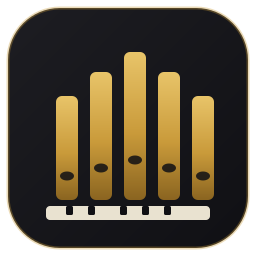

<p align="center">
  
</p>

<h1 align="center">MagnusOrgue</h1>

<p align="center">
  A MIDI virtual pipe organ for Android.<br/>
  Plug any MIDI keyboard in through an OTG cable and play.
</p>

<p align="center">
  
  
  
  
  
</p>

---

## About

MagnusOrgue turns an Android phone into a small, no-fuss virtual organ. There's no DAW, no patch editor, no cloud account — you open the app, you hear an organ. If you own a "mute" MIDI controller, connect it with a USB OTG cable and it just works, no configuration required.

The whole point is **low latency** and **zero friction**. Everything else is secondary.

## Features

- 🎹 **On-screen keyboard** — multitouch, ~2 octaves in landscape, octave shift buttons
- 🔌 **USB MIDI via OTG** — automatic plug-and-play detection, hotplug safe, no permission dialogs
- 🎛️ **Four real stops** — Principale 8', Flauto 8', Gamba 8' and Ottava 4', sampled from the Giubiasco organ; they combine like real ranks
- ⚡ **Low-latency audio** — native C++ engine on top of [Oboe](https://github.com/google/oboe), targeting < 20 ms
- 🎼 **32-voice polyphony** — big chords with both hands, no crackles
- 🔇 **Panic button** — because stuck notes happen to everyone

## How it's built

| Layer | Tech |
|---|---|
| UI | Kotlin + Jetpack Compose (custom `Canvas` keyboard) |
| MIDI | `android.media.midi` (`MidiManager`) |
| Audio | C++ / NDK with Oboe, sampled pipes (Giubiasco) |
| Bridge | A deliberately tiny JNI surface (7 functions) |
| Build | Gradle (Kotlin DSL) + CMake |

Minimum SDK is **26** (Android 8.0). No sensitive permissions, no network access, no analytics.

## Documentation

Design docs live in [`/docs`](docs/):

| Doc | Contents |
|---|---|
| [01-overview.md](docs/01-overview.md) | Product vision, MVP scope, success criteria |
| [02-features.md](docs/02-features.md) | Full feature list with priorities |
| [03-architecture.md](docs/03-architecture.md) | Stack, module structure, JNI interface, threading |
| [04-midi.md](docs/04-midi.md) | MIDI over OTG: connection flow, message parsing, edge cases |
| [05-audio.md](docs/05-audio.md) | Audio engine: synthesis approach, latency budget, real-time rules |
| [06-ui-ux.md](docs/06-ui-ux.md) | Screens, keyboard component, states and feedback |
| [07-roadmap.md](docs/07-roadmap.md) | Build phases — each one ends runnable on a phone |
| [08-testing.md](docs/08-testing.md) | Testing on a real device: adb, MIDI checklists, latency checks |

## Building

Requirements: JDK 17+ and the Android SDK with NDK + CMake (a `local.properties`
pointing at your SDK). Then:

The organ samples are not in the repo (they belong to the sample set's
author). Import them once from a local GrandOrgue set:

```bash
python3 tools/import_ranks.py "~/Documents/GrandOrgue/Organs/Giubiasco_GrandOrgue"
```

```bash
./gradlew assembleDebug         # build the APK
./gradlew installDebug          # build and install on a connected phone
./gradlew test                  # run the unit tests (MIDI parser etc.)
adb logcat -s MagnusOrgue       # tail the app logs
```

Tip: pair the phone over **Wi-Fi adb** (Developer options → Wireless debugging), because the USB port will be occupied by the OTG cable and the MIDI keyboard.

## Roadmap at a glance

`skeleton → audio engine → on-screen keyboard → MIDI over OTG → organ voicing → polish`

Details and acceptance criteria per phase in [07-roadmap.md](docs/07-roadmap.md).

## License

MagnusOrgue is free software, released under the [GNU General Public License v3.0](LICENSE). You can redistribute it and/or modify it under the terms of the GPL as published by the Free Software Foundation, either version 3 of the License, or (at your option) any later version.
